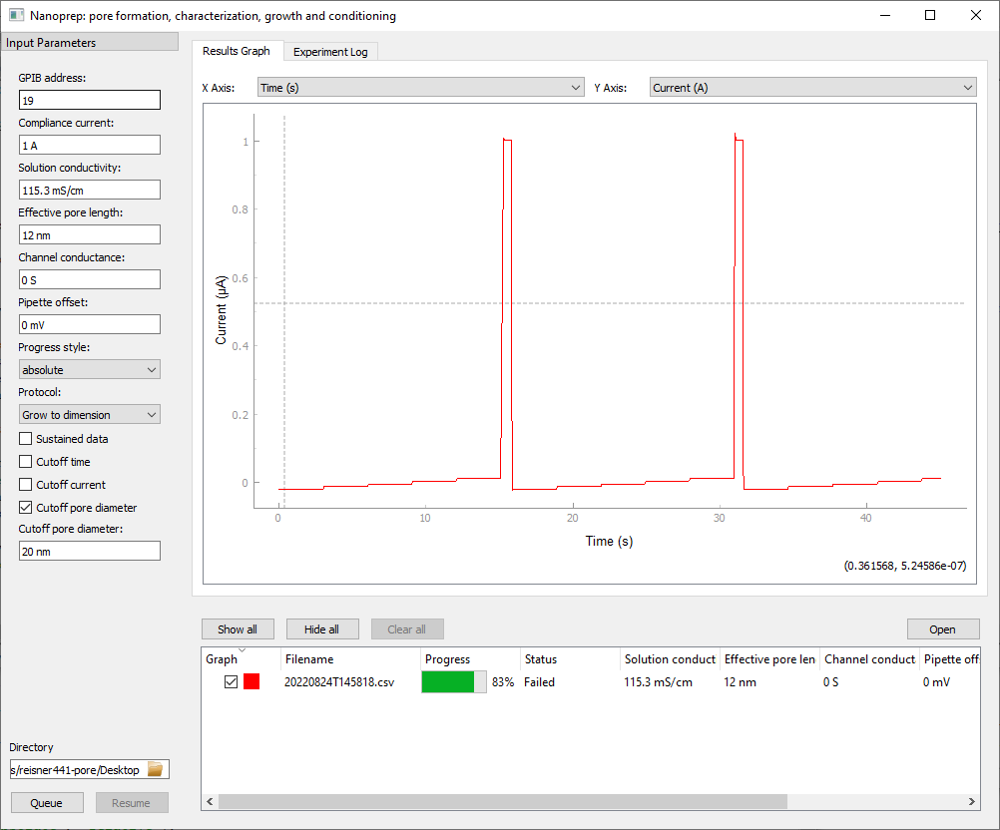
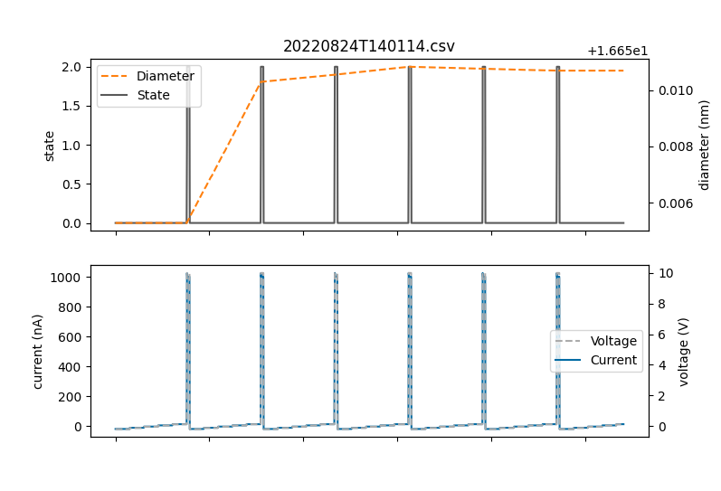

# NanoPrep

[](https://github.com/psf/black)

Nanopore formation, growth, conditioning and characterization using a [PyMeasure](https://pymeasure.readthedocs.io/en/latest/index.html) interface with a Keithley 2400 Sourcemeter.



Please cite this project if you use it in your research:

```BibTex
@Misc{nanoprep,
  author = {Xavier Capaldi},
  title = {Nanoprep: nanopore formation, characterization, growth and conditioning with Keithley 2400 Sourcemeter},
  howpublished = {\url{https://github.com/xcapaldi/nanoprep}},
  note = {Accessed YYYY-MM-DD},
  year = 2022,
}
```

This program was inspired by the following paper.
I strongly recommend citing it as well if you use this project for research that will be published.

```BibTex
@article{beamish-2012-precis-contr,
  author =	 {Eric Beamish and Harold Kwok and Vincent
                  Tabard-Cossa and Michel Godin},
  title =	 {Precise Control of the Size and Noise of Solid-State
                  Nanopores Using High Electric Fields},
  journal =	 {Nanotechnology},
  volume =	 23,
  number =	 40,
  pages =	 405301,
  year =	 2012,
  doi =		 {10.1088/0957-4484/23/40/405301},
  url =		 {https://doi.org/10.1088/0957-4484/23/40/405301},
  DATE_ADDED =	 {Tue Mar 2 10:06:05 2021},
}
```

## Drivers
The sourcemeter communicates with the computer via a [GPIB-USB-HS+ adapter from National Instruments](https://www.ni.com/en-ca/support/model.gpib-usb-hs-.html).


It has only been tested with Microsoft Windows due to the required drivers.
In particular I've tested it with [NI-VISA](https://www.ni.com/en-ca/support/downloads/drivers/download.ni-visa.html#346210) (v.20.0.0), [NI-488.2](https://knowledge.ni.com/KnowledgeArticleDetails?id=kA03q000000YGw4CAG&l=en-CA) (v.19.0.0) on Windows 10.

## Python dependencies
You will need Python 3.10 or higher installed.
You can check the dependencies in `requirements.txt` which holds the output of `pip freeze`.
If you want to install all the dependencies, just run `pip install -r requirements.txt`.

## Project structure
`nanoprep.py` is the main interface and loads everything to populate the main window.
A python configuration can be dropped directly onto `nanoprep.py` to start it with that configuration.
Starting `nanoprep.py` without a configuration will cause it to load the default configuration.
The configuration file must consist of one or more Protocols which inherit from the `Protocol` class in `utilities/protocol.py`.
Each protocol has a name and a static `run` method.
They must accept the standard set of parameters which are passed from PyMeasure `inputs` in `nanoprep.py` as a `protocol.Parameters` object.
The underlying PyMeasure tools have largely been wrapped by classes in the `utilities` directory.
In particular `aborter` is used to abort the running protocol, `emitter` handles data and progress and `timer` handles the timing of protocols.
There are helper classes as well for calculating pore sizes and quickly plotting data.
These `utilities` should be largely static as they are fundamental to easy protocol design.
In the `helpers` directory there are subsections of protocols that can be applied in a full protocol in a custom configuration.
For example, you can import from `iv_2022_0.py` to run an IV curve without programming all the logic manually yourself.

### Versioning
NanoPrep as a whole uses [semantic versioning](https://semver.org/) with the goal of minimizing any breaking change in `nanoprep` or the `utilities`.
Modules in the `helpers` directory use something similar to [date-based versioning](https://peps.python.org/pep-0440/).
The format is **year**.**version**.
A given version (`iv_2022_0`) should remain stable unless there is breaking change in NanoPrep overall.
Contributors can update the helper methods by creating a new version of the module (`iv_2022_1`) without breaking functionality for anyone using an older version.

## Configuration
A key feature of NanoPrep is its configuration file.
It uses a Python configuration format.
This is a bit more complex than a pure UI or simpler text configuration but provides much more power to the user.
There is a default configuration (`sample_config.py`) which should have examples of custom protocols.
The user can write their own configuration and only include the protocols they use.
If you start NanoPrep by dragging a configuration onto the Python file (or a shortcut to that file), it will start by loaded the configuration.
Only the defined protocols will be displayed in the menu.

### Components of configuration file
Since your config is a Python script, you can include arbitrary code and helper functions as you see fit.
Only a few components of your config are called explicitly from Nanoprep.

#### Imports
First you should import the helpers, utilities and any external modules your script will need to run:

```Python
from utilities.protocol import Protocol
from utilities.timer import Timer
from helpers.iv_2022_0 import iv_curve
from helpers.pulse_2022_0 import square_pulse, wait
from helpers.cbd_2022_0 import flat_cbd, ramp_cbd
from helpers.pipette_offset_2022_0 import pipette_offset
```

The only import strictly required is `utilities.protocol` which is necessary to define protocols in your config.

#### Default parameters
You can set a dictionary of the UI parameters to set them to some default values that make sense for you.
The dictionary must be named `defaults` and the keys should match the values shown below.

```Python
defaults = {
    "directory": ".", # default directory for recording data
    "gpib address": 19,
    "compliance current": 1, # A
    "solution conductivity": 115.3, # mS/cm - 2 M LiCl
    "effective length": 12, # nm
    "channel conductance": 0, #S
    "pipette offset": 0, # mV
    "progress style": "absolute",
    "sustained": False,
    }
```

For example, you could change the default save directory to your own data directory and change the solution conductivity to match the buffer you use most frequently.
You are not required to define any or all of the defaults in your config.
A fallback is defined in case you don't select any values.

#### Protocols
Your config must contain at least one protocol to be valid.
A protocol is a subclass of the `utilities.protocol` `Protocol` class.
In pseudocode, it looks like this:

```Python
class NameOfYourProtocol(Protocol):
    name = "Name displayed in protocol selection dropdown in the UI"

    @staticmethod
    def run(parameters): # parameters is a protocol.Parameters object holding standard UI parameters
        # The actual protocol logic goes here in the run static method.
        )
```

Notice that your protocol must have a name that is used in the UI and it must have a run static method that accepts the `protocol.Parameters` object which contains:

- sourcemeter
- log
- aborter
- emitter
- solution_conductivity
- effective_length
- channel_conductance
- pipette_offset

Just because the protocol's run method has to accept these parameters, doesn't mean it has to use them.

Here is a sample protocol that runs a mini-IV curve between voltage pulses.
It will automatically stop when it reaches the cutoff.
Note this protocol is taking advantage of helper functions to do the pulse and IV curve.

```Python
class SquareWaveGrowToDimension(Protocol):
    name = "Grow to dimension"

    @staticmethod
    def run(p):
        t = Timer()
        p.log.info("Start square wave pore growing protocol")
        # take initial IV curve to determine starting size
        init_diameter = iv_curve(
            t,
            p.sourcemeter,
            p.log,
            p.emitter,
            p.aborter,
            p.solution_conductivity,
            p.effective_length,
            p.channel_conductance,
            p.pipette_offset,
            sweep_start=-0.2,  # first sweep here
            sweep_step=0.08,  # sweep step
            sweep_number=5,  # number of sweeps
            sweep_duration=3,  # sweep duration
            sweep_discard=0.75,  # portion of sweep to disregard for pore size estimation
            sweep_stacked=False,  # do not stack the sweeps
            estimation_state=0,  # state number for running IV
            reporting_state=1,  # state for reporting estimated size
        )

        diameter = init_diameter
        cutoff_diameter = 20e-9  # nm

        while True:
            if diameter >= cutoff_diameter:
                break

            p.emitter.progress(init_diameter, cutoff_diameter, diameter)

            if p.aborter.should_abort():
                break

            square_pulse(
                t,
                p.sourcemeter,
                p.emitter,
                p.aborter,
                p.pipette_offset,
                pulse_time=0.5,  # pulse time
                pulse_voltage=10,  # pulse voltage
                state=10,  # state for pulse application
            )
            diameter = iv_curve(
                t,
                p.sourcemeter,
                p.log,
                p.emitter,
                p.aborter,
                p.solution_conductivity,
                p.effective_length,
                p.channel_conductance,
                p.pipette_offset,
                sweep_start=-0.2,  # first sweep here
                sweep_step=0.08,  # sweep step
                sweep_number=5,  # number of sweeps
                sweep_duration=3,  # sweep duration
                sweep_discard=0.75,  # portion of sweep to disregard for pore size estimation
                sweep_stacked=False,  # do not stack the sweeps
                estimation_state=0,  # state number for running IV
                reporting_state=1,  # state for reporting estimated size
            )

```

### Dynamic reload
If for some reason you need to modify a protocol mid-experiment, you do **not** need to restart NanoPrep.
Every time you click `Queue` in the NanoPrep UI, the config file is parsed again, reloading the latest changes to you protocols.
This means changing something like the pulse voltage is as simple as changing it in your config, saving the config and then clicking `Queue`.

## Emitted data
The saved data is formatted as a CSV with metadata and header:

```CSV
#Procedure: <__main__.NanoprepProcedure>
#Parameters:
#	Channel conductance: 0 S
#	Compliance current: 1 A
#	Effective pore length: 12 nm
#	GPIB address: 19
#	Pipette offset: 0 mV
#	Progress style: absolute
#	Protocol: Grow to dimension
#	Solution conductivity: 115.3 mS/cm
#	Sustained data: False
#   Sample identifier: Batch B, chip 13
#Data:
Time (s),Voltage (V),Current (A),Estimated diameter (nm),State
0.00262410007417202,-0.2,-2.011296e-08,nan,0
0.20733339991420507,-0.2,-2.010452e-08,nan,0
0.32290820009075105,-0.2,-2.010369e-08,nan,0
```

The metadata contains all experimental parameters relevant to the protocol.
As can be seen from the header, you can record Time, Voltage, Current, Estimated pore diameter, and an arbitrary state.
You do not need to supply a value for every field.
Unused fields will be filled by a `numpy.nan`.
State is very useful when you have some protocols that consists of smaller protocols lumped together.
For example, one that combines breakdown with characterization and conditioning.
You could pass states for each of the three processes so that later it is easier to filter the data.

### Sustained data
There is an option for *sustained* data which means that instead of recording `numpy.nan` when a particular data point is not explicitly provided, instead the last recorded value is written.
The comes into play mostly for the estimated pore diameter.
You estimate the diameter infrequently so most of the time that column should consist of nan.
For example: `nan, nan, nan, 16.0018, nan, nan`.
The only problem with this is plotting.
While the protocol is still running, the plot looks okay but when it is done, the plot will flicker and disappear.
This is because the plotting system cannot handle the missing data.
You can typically see the plot in the UI again by picking the axes manually to reset them.
Alternatively use the quick plotting utilities described later.
It is recommended to *not* sustain the data since it makes it more confusing to process the recorded values.
If you choose to record sustained data, I strongly recommend combining this with a state system so that you can later filter your data for particular states.
For example, if you always emit state `1` when recording pore size, you can filter to only show rows with state `1` to get the real estimation data points instead of the all the sustained data between.

### Quick plotting
To offset the weaknesses of the PyMeasure plotting interface, two utility plotters are provided.
Both plotters can handle unsustained data by linearly interpolating over nan data points.
On a Microsoft Windows machine, you can drag and drop a data CSV directly onto the icon for these scripts and they will display the plot.
The plotters are backward compatible with data collected from older NanoPrep (and pre-NanoPrep) software that only has time, voltage and current columns.
Feel free to extend to your needs using this as a framework.

#### `utilities/quick-plot.py`
[Matplotlib](https://matplotlib.org/) backend.



#### `utilities/quick-plotly.py`
[Plotly](https://plotly.com/python/) backend.
This has the advantage of Plotly's full interactivity and filtering on the plots.


## Contributor guidelines
Everyone is welcome to contribute to this project.
Unfortunately there is not an easy way to test changes or new protocols without have access to the actual hardware.
I am open to running those tests myself if you are unable.
To contribute, you can fork the project and open a pull request.
I just ask that you add any new dependencies to `requirements.txt` and run [black](https://github.com/psf/black) on any code changes.
Use [Google-style docstrings](https://sphinxcontrib-napoleon.readthedocs.io/en/latest/example_google.html) (although my current documentation is sparse).
The two easiest points of entry are adding your own configuration to the `contrib` directory as a reference for other or adding an new/improved `helper`.

Here are some larger tasks that I think would contribute greatly to the project:

[ ] Apply the [typing](https://docs.python.org/3/library/typing.html) library across the project for clarity.
[ ] Introduce system tests for individual protocols using dummy `emitters`, `loggers`, `timers` and `sourcemeters`.
[ ] Create a dummy sourcemeter for PyMeasure so we can write actual system tests.
[ ] Documentation (ideally use Google-style docstrings and [lazydocs](https://github.com/ml-tooling/lazydocs).
[X] Migrate old protocols and write new one.
[ ] Write a configuration validator so users can see what parts of this config are not working.

## License
MIT License
Copyright (c) 2022 Xavier Capaldi
